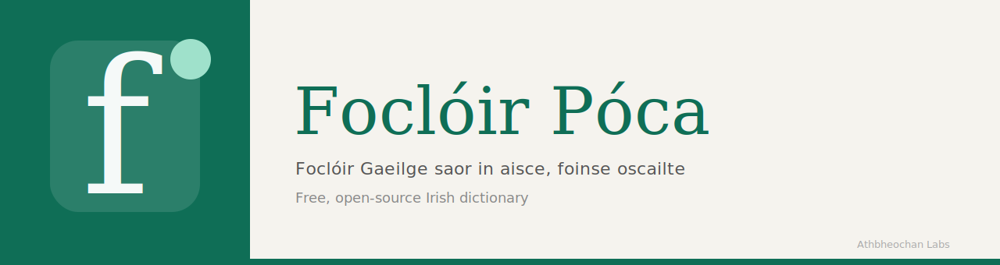

# Foclóir Póca

*Foclóir Gaeilge saor in aisce, foinse oscailte, do do phóca.*  
Free, open-source Irish dictionary — for your pocket.

Built under [Athbheochan Labs](https://athbheochan.ie).

---

## Faoin bhfeidhmchlár · About

Foclóir Póca is a fast, distraction-free interface to Ireland's two principal Irish-language dictionaries: Ó Dónaill's *Foclóir Gaeilge–Béarla* via teanglann.ie, and the National English–Irish Dictionary via focloir.ie. Type a word, get the answer. No accounts, no login, no streaks.

This is not a language learning app. It is a reference tool for people who already use Irish — the kind you reach for when you encounter an unfamiliar word in a text, or need a precise English equivalent mid-sentence. It assumes the reader knows what a dictionary is and why they want one.

The project sits within Athbheochan Labs' interest in building infrastructure that treats Irish as a first-class language in software. A dictionary is the smallest meaningful unit of that work.

## Gnéithe · Features

Both dictionaries are available simultaneously. An Irish word returns its Ó Dónaill entry — numbered senses, usage examples, and a list of compound words built on the headword. An English word returns its NEID translations grouped by part of speech, with domain labels where relevant.

Search state is URL-driven: results are shareable and browser history works as expected.

Grammar inflections and pronunciation audio are planned for an upcoming release.

## Teicneolaíocht · Stack

- **SvelteKit** · TypeScript — web app and API
- **Capacitor** · Android (iOS coming) — native wrapper
- **AWS Amplify** — hosting and deployment
- **Data** — teanglann.ie · focloir.ie (Foras na Gaeilge)

## Tús áite · Getting started

```bash
git clone https://github.com/athbheochan-labs/focloir-poca
cd focloir-poca
npm install
npm run dev
```

Create a `.env` from `.env.example`:

```
ORIGIN=http://localhost:5173
```

**Android:** with Android Studio installed —

```bash
npm run build:android
npx cap open android
```

**iOS:** on macOS —

```bash
npx cap add ios
npm run build:ios
npx cap open ios
```

## Rannchuidiú · Contributing

Contributions are welcome at every level of experience and in any form. Irish language knowledge is as valuable here as TypeScript knowledge: if you spot a gap in the displayed data, an incorrect gloss, or a word that needs attention, that is a meaningful contribution.

No Svelte or JavaScript experience is required to get started. CSS design tokens are in [`src/app.css`](src/app.css) and are easy to adjust without touching component code. Data fixtures live in [`src/lib/fixtures/`](src/lib/fixtures/). Issues marked [`good first issue`](https://github.com/athbheochan-labs/focloir-poca/issues?q=label%3A%22good+first+issue%22) are a good entry point regardless of background.

## Sonraí · Data

Word data is sourced from [teanglann.ie](https://www.teanglann.ie) and [focloir.ie](https://www.focloir.ie), both operated by Foras na Gaeilge. A formal data access request is pending. No data is redistributed or stored beyond the short-lived in-memory cache used for performance. Any derived use requires attribution to Foras na Gaeilge.

## Ceadúnas · Licence

MIT. The code is free to use, modify, and distribute. Word data belongs to Foras na Gaeilge and is subject to their terms.
